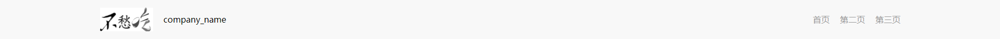
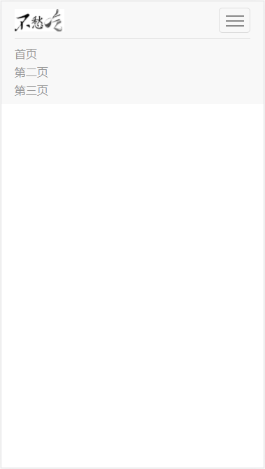
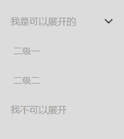

# st-ui
基于 j Query 封装一些常用ui组件
## 

## 使用方法
引入css文件夹下的 st-ui.css 文件；
js文件夹下的 moveBox.js 文件；
js文件夹下的 st-ui.js 文件；

注意：moveBox.js 文件 要在 st-ui 文件之前引入；JS方法的参数是json对象格式。

## 
## 布局

采用rem布局，整屏宽分为12等分，即整屏宽等于12rem。

## 
## 导航条

##### 效果演示

###### pc端效果图 :


###### 手机端（右侧菜单会变成下拉形式）:


##### HTML
```
<div class="st_navbar"></div>
<div class="st_navbar_menu_height"></div>
<div class="st_navbar_menu_phone">
    <ul>&nbsp;</ul>
</div>
```

##### JavaScript
```
st_navbar({
    logo: './images/logo.png',
    company_name: 'company_name',
    navbar_menu: ["首页", "第二页", "第三页"]
});
```

##### 参数说明：
参数格式：json对象

| 参数名          | 参数说明               |
| ------------ | ------------------ |
| logo         | 网站logo             |
| company_name | 网站表示语言或公司名，在logo右侧 |
| navbar_menu  | 导航菜单，位于导航条右侧       |
## 
## 侧边栏

##### 效果演示


##### HTML
```
<div class="st_left_navbar">
    <ul>
                
        <!-- 有下级菜单的情况 -->
        <li class="st_first_nav st_open_second clearFloat">
            <span class="st_first_nav_title">
                我是可以展开的
            </span>
            <span class="st_first_nav_arrow">
                
                
            </span>
        </li>
        <ul class="st_second_nav_box">
            <li class="st_second_nav st_get_into">二级一</li>
            <li class="st_second_nav st_get_into">二级二</li>
        </ul>

        <!-- 没有下级菜单的情况 -->
        <li class="st_first_nav st_open_second st_get_into clearFloat">
            <span class="st_first_nav_title">
                我不可以展开
            </span>
            <span class="st_first_nav_arrow">
                <div class="first_menu_arrow_right"></div>
                <div class="first_menu_arrow_bottom"></div>
            </span>
        </li>
        <ul class="st_second_nav_box"></ul>

    </ul>
</div>

<!-- 右侧frame -->
<div style="width:85%; float:right;">
    <div class="st_right_frame">
        可以展开 > 二级一
    </div>
    <div class="st_right_frame">
        可以展开 > 二级二
    </div>
    <div class="st_right_frame">
        我不可以展开
    </div>
</div>
```

##### JavaScript
```
st_sidebar();
```